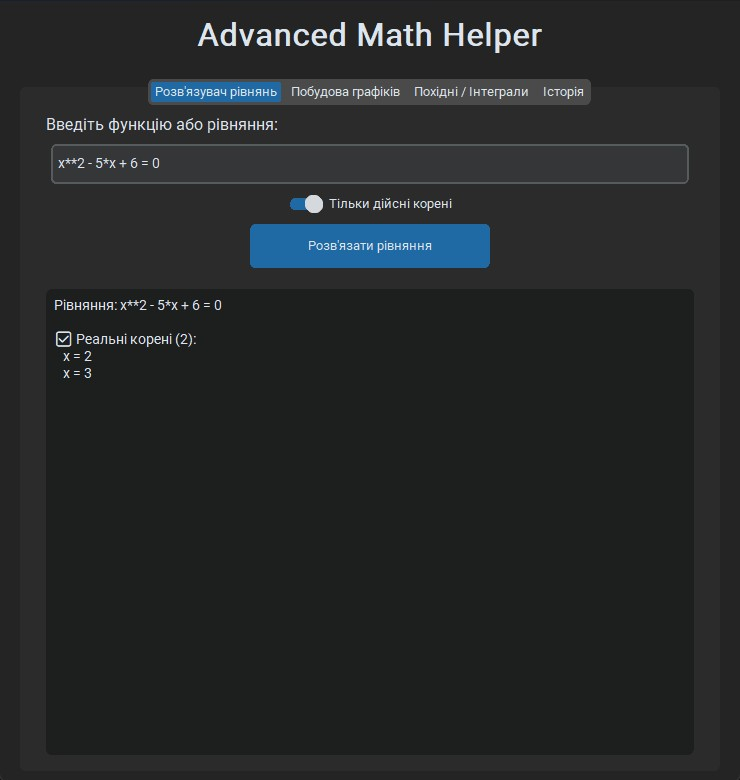
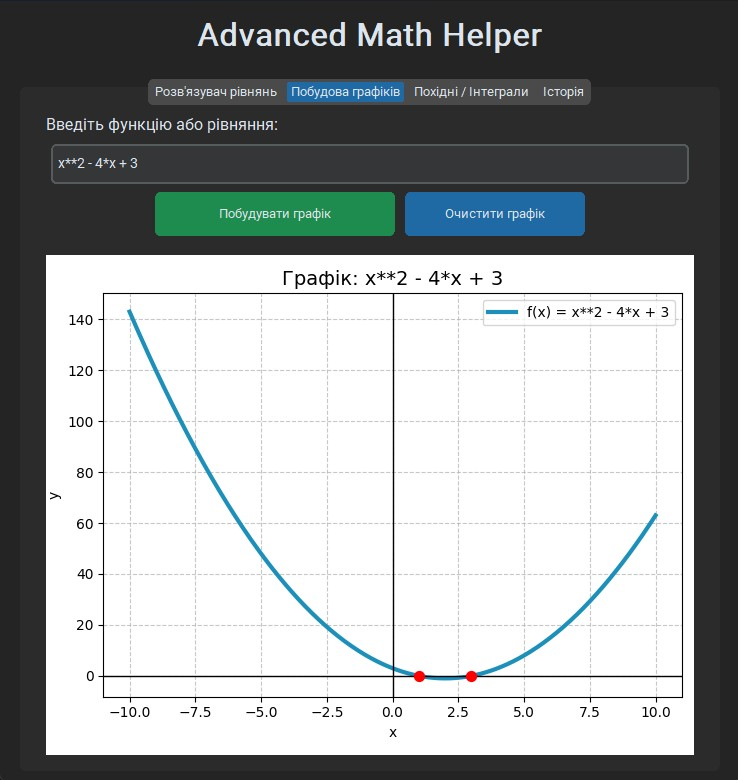

# Advanced Math Helper

**Сучасний графічний помічник з математики** для школярів та абітурієнтів.

Програма допомагає швидко розв’язувати рівняння, будувати графіки, знаходити похідні та обчислювати інтеграли в зручному сучасному інтерфейсі.


## Можливості

- Розв’язання рівнянь (з можливістю показувати тільки дійсні корені)
- Побудова графіків функцій з автоматичним позначенням коренів
- Обчислення похідних
- Обчислення невизначених та визначених інтегралів
- Історія всіх рішень (зберігається навіть після закриття програми)
- Сучасний темний дизайн

## Як використовувати

1. Запустіть програму (`main.py`)
2. У будь-якій вкладці введіть рівняння або функцію у верхнє поле

### Приклади використання:

**Розв'язувач рівнянь:**

**Вхідні дані:** `x**2 - 5*x + 6 = 0`
**Результат:**


**Побудова графіків:**

**Вхідні дані:** `x**2 - 4*x + 3`
**Результат:**


**Похідні / Інтеграли:**
**Похідна:**
**Вхідні дані:** `x**3 - 6*x**2 + 9*x`
**Результат:**

**Невизначений інтеграл:**
**Вхідні дані:** `x**2 + sin(x)`
**Результат:**

**Визначений інтеграл:**
**Вхідні дані:** `x**2` (вкажіть межі, наприклад від 0 до 2)
**Результат:**


Перемикайтеся між вкладками - введене рівняння зберігається.

## Вимоги

- Python 3.10 або новіший

### Встановлення залежностей

```bash
pip install customtkinter sympy matplotlib numpy
```

## Запуск програми

```bash
python main.py
```

## Структура проекту

```
Advanced-Math-Helper/
├── main.py
├── math_solver.py
├── plotter.py
├── utils.py
├── history.py
├── data/
│   └── history.json
└── README.md
```

## Технології

- **CustomTkinter** — сучасний графічний інтерфейс
- **SymPy** — символьна математика
- **Matplotlib** — побудова графіків
- **NumPy** — робота з числовими масивами

---
**Створено у квітні 2026**  
Автор: Огмрцян Максим

Цей проект є частиною мого портфоліо для вступу до вищих навчальних закладів України.
---
